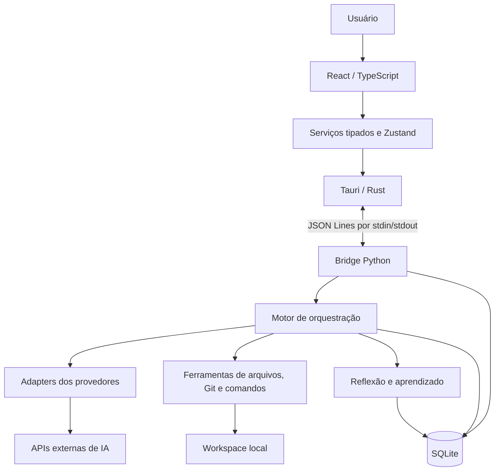
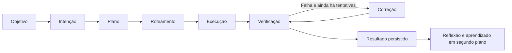

# Relatório de análise do AgentMesh / Orquestrador

Data: 12 de setembro de 2026. Escopo: código local, documentação, configurações, testes e fluxos entre React, Rust e Python.

## 1. Parecer geral

O projeto é um aplicativo desktop para coordenar agentes de IA em tarefas de engenharia de software. O usuário cadastra um projeto local, descreve um objetivo e acompanha planejamento, seleção de agentes, execução de ferramentas, verificação e registro do resultado.

Existe implementação substancial: interface funcional, serviços de orquestração, adapters HTTP de três provedores, persistência SQLite, ferramentas de arquivos/Git/comandos, aprendizado e testes automatizados. A divisão em camadas facilita manutenção e testes isolados.

Entretanto, não há evidência suficiente para classificá-lo como pronto para distribuição pública. Esta análise encontrou falhas reproduzíveis na busca, um teste de ponta a ponta que ficou bloqueado e lacunas nos controles transversais de segurança, orçamento e cancelamento. Algumas garantias da documentação são mais abrangentes que o comportamento implementado.

A avaliação corresponde ao diretório de trabalho, incluindo uma alteração preexistente em `desktop/src-tauri/src/bridge/manager.rs`. Nenhum código funcional foi modificado para elaborar o relatório. Não foram utilizadas credenciais reais nem chamadas pagas aos provedores. A compatibilidade atual dos identificadores de modelos e preços com serviços externos não foi validada; os valores do catálogo são configurações locais, não informações comerciais confirmadas.

## 2. Arquitetura e responsabilidades



| Camada | Localização | Responsabilidade |
|---|---|---|
| Interface | `desktop/src/pages`, `components`, `layouts` | Formulários, navegação, progresso e resultados |
| Estado e integração | `desktop/src/stores`, `services`, `hooks` | Estado de projetos/execuções, chamadas ao Tauri e assinaturas de eventos |
| Aplicativo nativo | `desktop/src-tauri/src` | Janela, comandos e supervisão do processo Python |
| Protocolo | `core/bridge` | Validação de mensagens, sessão e despacho de comandos |
| Orquestração | `core/orchestrator` | Planejamento, roteamento, execução, verificação e consolidação |
| Agentes e provedores | `core/agents`, `core/providers` | Papéis, prompts, modelos, HTTP e saúde dos provedores |
| Ferramentas e segurança | `core/tools`, `core/security` | Acesso ao workspace e políticas de operações |
| Aprendizado | `core/learning`, `core/memory` | Regras, reflexões, playbooks, métricas e memórias |
| Persistência | `core/database` | Migrações, repositories, integridade e backups |

A aplicação usa React 19, TypeScript, Zustand, Tailwind e componentes Radix; o shell usa Tauri 2 e Rust. O núcleo requer Python 3.12 ou superior e depende de aiosqlite, Pydantic, httpx, jsonschema, keyring, platformdirs e pathspec. Versões declaradas e instaladas podem diferir dentro dos intervalos dos manifests.

O transporte local não abre servidor HTTP: Rust e Python trocam mensagens JSON delimitadas por linha. Um token de sessão identifica a sessão, e `core/security/allowlist.py` enumera as operações aceitas. Isso reduz a superfície exposta, mas não substitui a segurança de cada handler ou ferramenta.

## 3. Inicialização e uso pela interface

Ao iniciar, Tauri resolve o interpretador Python e executa `python -m core.bridge.main`. `core/bridge/context.py::build_context()` cria o banco, repositories, registros de agentes e modelos, provedores configurados e serviços de execução/aprendizado.

As chaves dos provedores são carregadas do armazenamento de credenciais do sistema operacional. Sem chaves, o usuário pode trabalhar com projetos, histórico e configurações, mas não há execução real de IA. O provider mock é um mecanismo explícito de teste, não uma IA local substituta.

O startup recupera tarefas e execuções interrompidas, marcando trabalho incompleto como falha. Isso evita estados eternamente “em execução”; não retoma automaticamente a operação de onde parou e não desfaz alterações já gravadas no workspace.

Fluxo de uso:

1. Abrir Configurações e cadastrar/testar as credenciais necessárias.
2. Definir os limites de custo desejados.
3. Criar um projeto e associar a pasta local de trabalho.
4. Abrir Workspace, descrever a tarefa e escolher o modo.
5. Selecionar agentes quando o modo pedir e enviar a tarefa.
6. Acompanhar fases, agentes, custo estimado e resultado; cancelar se necessário.
7. Consultar Execuções para histórico, eventos e evidências.
8. Consultar Aprendizado para candidatos, regras, playbooks, desempenho e versões de prompts.

As páginas principais são Workspace, Agents, Executions, Learning e Settings. `ErrorBoundary` isola erros de renderização; ele não captura automaticamente rejeições de Promises em handlers assíncronos. Algumas abas de aprendizado carregam dados sem tratamento explícito de falha, o que merece melhoria de experiência e diagnóstico.

## 4. Como uma tarefa é executada



**Intenção.** `intent_analyzer.py` usa heurísticas e palavras-chave para identificar categoria, complexidade e risco. Essa classificação é barata, porém pode interpretar objetivos ambíguos incorretamente.

**Plano.** No modo automático, `planner.py` tenta um playbook compatível; quando cabível, usa planejamento por IA; mantém um fallback por regras. O plano de IA tem schema, limite de oito etapas e uma tentativa de reparo do JSON. As dependências representam quais etapas precisam de resultados anteriores.

**Roteamento.** `router.py` seleciona agente e modelo considerando capacidades, disponibilidade, características de custo/prioridade e sinais de desempenho/regras aprendidas. A escolha e sua justificativa são registradas.

**Contexto.** `context_builder.py` seleciona arquivos por relevância heurística. Por padrão, inclui até seis arquivos, com limite de 8.000 bytes por arquivo, e resume resultados anteriores em até 400 caracteres cada. Aplica mascaramento de segredos aos arquivos desse contexto inicial. Isso economiza tokens, mas pode omitir informações importantes; agentes podem buscar ou ler mais arquivos por ferramentas.

**Execução.** `engine.py` divide o grafo em camadas e executa etapas independentes com `asyncio.gather`. `StepExecutor` controla chamadas, tentativas, timeout, orçamento e um ciclo de até cinco interações de ferramentas. A concorrência padrão é limitada a oito chamadas globais, quatro por provedor e duas por modelo no caminho gerenciado pelo executor.

**Verificação.** Primeiro exige etapas concluídas e saída não vazia. Para certas categorias de código, tenta executar testes e lint identificados no projeto. Comandos não identificados são omitidos. Portanto, “concluído” significa aprovado pelas verificações efetivamente aplicadas; não prova correção funcional total. Build e typecheck não fazem parte da seleção automática atual do Verifier.

**Correção e resultado.** Falhas podem gerar rodadas limitadas de correção. O agregador reúne saídas, evidências, tokens e custos das etapas. Seu resumo é uma concatenação das respostas, não uma nova síntese inteligente para todas as modalidades.

**Pós-execução.** O motor agenda reflexão e aprendizado em segundo plano. O encerramento normal aguarda reflexões pendentes antes de fechar banco e provedores.

## 5. Modos e agentes

| Modo | Comportamento implementado |
|---|---|
| Automático | Estrutura definida por playbook, IA ou regras |
| Manual | Uma etapa com agente explicitamente selecionado, quando informado |
| Pipeline | Agentes selecionados em sequência, cada etapa dependendo da anterior |
| Debate | Candidatos independentes em paralelo, seguidos de julgamento/síntese |
| Consenso | Atualmente compartilha a mesma estrutura de Debate |

Pipeline sem agentes e Debate/Consenso com menos de dois agentes caem no plano automático por regras. Não há algoritmo distinto de consenso iterativo no fluxo inspecionado. Quando o julgamento por IA falha, a heurística seleciona a resposta bem-sucedida mais longa; comprimento não comprova qualidade.

Os seis especialistas padrão são Claude Architect, Claude Reviewer, Gemini Researcher, Gemini Analyst, Codex Developer e Codex Tester. Existem ainda três agentes mock para testes. Cada agente define capacidades e permissões; por exemplo, pesquisadores têm leitura e desenvolvedores podem escrever e executar determinadas verificações.

Os nomes “Codex Developer/Tester” representam papéis internos com `provider="openai"`. No código, o adapter OpenAI realiza HTTP para `/v1/chat/completions`; não inicia uma instalação do aplicativo/CLI Codex. Analogamente, os outros adapters encapsulam APIs dos respectivos provedores.

O registro de agentes em execução é construído em memória a partir de defaults. Embora haja tabela de agentes, isso não equivale a um editor completo de agentes persistidos e recarregados dinamicamente.

## 6. Persistência e aprendizado

Há quatro arquivos de migração SQL, com tabelas para projetos, tarefas, execuções, etapas, conversas/mensagens, configurações, prompts, modelos, uso, eventos, auditoria, memórias e aprendizado.

A relação principal é: projeto → tarefas → execuções → etapas/evidências. Conversas e mensagens existem no modelo de dados, mas sua presença não comprova uma experiência completa de chat conversacional na interface atual.

SQLite opera com chaves estrangeiras, WAL, `synchronous=NORMAL` e espera de até cinco segundos para locks. Repositories concentram a maior parte do acesso a dados. Backup/restauração e checagem de integridade têm implementação e comandos expostos.

O aprendizado não treina os pesos das IAs. Ele registra observações e ajusta regras operacionais, seleção de agentes/modelos, playbooks e propostas de prompts. O ciclo inclui candidatos, observação, ativação e rejeição/depreciação, com confiança, evidências e histórico.

Há modos manual, assistido e autônomo, limites de ativações e categorias que exigem revisão humana. Prompts têm versões e rollback; o Core Prompt possui proteção contra alteração automática. A medição de uso de contexto verifica se caminhos aparecem na resposta final: é uma aproximação, não prova de quais arquivos o modelo realmente utilizou.

## 7. Segurança: proteções e limites reais

Proteções implementadas incluem allowlist do bridge, sessão, permissões por agente/operação, resolução de caminhos dentro do workspace, escrita atômica e backup da versão anterior de arquivos. Operações de risco alto/crítico exigem pré-autorização em `Task.input.confirmed_operations`; a interface ainda não oferece confirmação interativa para esse fluxo.

O ShellRunner usa argumentos estruturados, ambiente reduzido, limites de saída e mecanismos de timeout/término de processos. Entretanto, executar `npm run test`, pytest ou um build executa código do próprio projeto com os privilégios do processo. A validação de caminhos das ferramentas não constitui isolamento de sistema operacional para esses subprocessos. Projetos não confiáveis exigem uma política específica ou execução em ambiente isolado.

As tags de contexto e as regras de linguagem ajudam contra prompt injection, mas não fornecem garantia estrutural de contenção. A aplicação ainda depende das políticas de ferramentas e da qualidade das validações para limitar ações.

## 8. Achados prioritários com evidências

As prioridades abaixo são de correção técnica, não uma classificação formal de vulnerabilidades. “Confirmado por leitura” identifica um fluxo diretamente presente no código; não significa exploração em produção.

| Prioridade | Achado e evidência | Impacto / encaminhamento |
|---|---|---|
| Alta | `tool_schemas.py` retorna conteúdo bruto em ReadFile/SearchFiles; `executor.py` o envia como mensagem TOOL sem SecretScanner | A proteção do contexto inicial não cobre esse caminho. Centralizar mascaramento antes de enviar saídas de ferramentas aos provedores e revisar persistência de payloads |
| Alta | Em `executor.py`, a mensagem ASSISTANT que antecede resultados de ferramentas guarda apenas texto; o adapter OpenAI não reconstrói ali os `tool_calls` originais | Contrato de conversação de ferramentas incompleto no código inspecionado. Validar rodadas completas dos adapters, além do parsing isolado; o efeito em API real não foi testado |
| Alta | Planner, Judge e Reflection chamam `provider.execute` diretamente, fora do StepExecutor | Orçamento, métricas e cancelamento não têm aplicação uniforme. Criar uma camada comum para todas as chamadas |
| Alta | `budget.py` verifica gasto já registrado, sem reservar custo de chamadas em voo | O limite não é um teto financeiro exato; uma chamada ou chamadas paralelas podem ultrapassá-lo. Reservar estimativas e reconciliar uso real |
| Alta | `tauri.conf.json` possui `externalBin: []`; `process.rs` sempre resolve interpretador e módulo Python | Bundle nativo ainda não é distribuição autocontida. Implementar caminho de produção e validar em máquina limpa |
| Média | Duas falhas em `test_search_tool.py`, reproduzidas com ripgrep disponível | Retorna `./app.js` em vez de `app.js` e inclui `node_modules` sem ignore explícito. Uniformizar formato e exclusões com o fallback Python |
| Média | SearchTool usa regex sensível a maiúsculas com rg e substring sem distinção de maiúsculas no fallback | A mesma consulta muda de significado conforme a máquina. Definir um contrato único |
| Média | Smoke ficou bloqueado; `_read_message()` chama `stdout.readline()` bloqueante dentro de um laço com deadline | O timeout de dez segundos não interrompe a leitura. Usar leitura assíncrona ou mecanismo com timeout real e limpeza garantida do processo |
| Média | `_steps_from_plan_data()` descarta dependências desconhecidas antes da validação do grafo | Um plano inválido pode perder a dependência e executar etapas fora da ordem desejada. Rejeitar referências desconhecidas antes da conversão |
| Média | Revisão adicional de alto risco é inserida em regras/playbooks, mas não é imposta ao resultado do AIPlanner | A garantia descrita de revisão obrigatória não é uniforme. Aplicar invariantes após qualquer fonte de plano |
| Média | Verifier omite verificações sem comando reconhecido; CommandPlanner olha a raiz e escolhe uma resolução por ação | Monorepos e múltiplas stacks podem ficar parcialmente verificados. Registrar explicitamente o que não foi testado e permitir múltiplos diretórios/comandos |
| Média | CommandPlanner e execução de ferramentas não propagam o evento de cancelamento do motor até ShellRunner | Cancelar tarefa pode aguardar a ferramenta/verificação terminar ou atingir seu timeout. Propagar cancelamento em todo o fluxo |
| Média | `app.security.csp` está `null` | Falta política de conteúdo explícita no webview. Definir restrições adequadas ao frontend |
| Média | `pip-audit` e `npm audit` usam `|| true` no CI | Achados desses scanners não bloqueiam o pipeline. Estabelecer critérios de bloqueio e exceções registradas |

Também há diferença entre documentação e startup: `quick_integrity_check()` existe e é chamado por handler de diagnóstico, mas não foi encontrado no caminho de inicialização de `main.py`/`build_context()`. Assim, a checagem automática de integridade no startup descrita em documentos não está demonstrada.

Os metadados Python, npm e Tauri indicam `0.1.0`, enquanto o README apresenta a entrega como v1.0. A documentação também afirma ausência de toolchain Rust no ambiente, mas nesta análise cargo, clippy e testes Rust funcionaram. Esses textos precisam ser alinhados ao estado real.

## 9. Validação executada

| Verificação | Resultado observado |
|---|---|
| Ruff em `core tests` | Passou |
| Mypy em `core` | Passou, 135 arquivos de código |
| Python: execução inicial com unitários, integração e smoke | 464 passaram e 2 falharam antes da interrupção do smoke bloqueado |
| Python: unitários e integração, reexecutados sem smoke | 464 passaram e 2 falharam em 14,14 segundos |
| Frontend: typecheck e ESLint | Passaram |
| Frontend: Vitest | 46 testes passaram em 13 arquivos |
| Frontend: build Vite | Passou |
| Rust: `cargo fmt -- --check` | Passou |
| Rust: `cargo clippy --offline --all-targets -- -D warnings` | Passou |
| Rust: `cargo test --offline` | 9 testes passaram |

O comando geral `./scripts/test.sh` não passou: houve falhas Python e interrupção do smoke. Frontend e Rust foram executados separadamente para não depender dessa interrupção. O bloqueio foi observado por aproximadamente um minuto; a causa do silêncio do sidecar não foi determinada, mas o defeito de timeout no cliente de teste é visível no código.

A reprodução isolada da busca, em pasta temporária com `app.js` e `node_modules/lib.js`, retornou ambos, com prefixo `./`, confirmando as duas divergências do caminho ripgrep. Não foi necessário acessar arquivos do usuário para reproduzir.

Não foram realizados: teste visual da janela nativa, instalação em máquina limpa, validação em Windows/Linux, chamadas a APIs reais, medição percentual de cobertura, auditoria externa de dependências ou avaliação de desempenho em projetos grandes. Testes aprovados com mocks não demonstram compatibilidade ponta a ponta com provedores reais.

## 10. Como executar e desenvolver

Requisitos declarados: Python 3.12+, Node.js 20+, Rust e dependências nativas do Tauri. No macOS, a documentação pede Xcode Command Line Tools; no Windows, ferramentas C++ e WebView2. Para reproduzir builds, usar os arquivos de lock e compatibilizar a versão de Node com as dependências resolvidas.

Na raiz do projeto:

```bash
./scripts/setup.sh
./scripts/dev.sh
```

No Windows, usar `scripts/setup.ps1` e `scripts/dev.ps1`. Setup instala dependências; dev inicia Vite/Tauri e o processo Python. Abrir apenas Vite no navegador não reproduz os comandos nativos do bridge.

Variáveis relevantes: `ORCH_PYTHON_BIN` seleciona o interpretador; `ORCH_CORE_CWD` seleciona o diretório do core; `ORCH_DATA_DIR` muda o local de dados, útil para testes isolados. `ORCH_SESSION_TOKEN` é fornecido ao sidecar e `ORCH_ENABLE_MOCK_PROVIDER` é opt-in de teste.

Verificações disponíveis:

```bash
.venv/bin/ruff check core tests
.venv/bin/mypy core
.venv/bin/python -m pytest tests/python tests/integration
# O smoke requer corrigir/investigar o bloqueio descrito neste relatório.
cd desktop
npm run typecheck
npm run lint
npm run test
npm run build
```

O CI configura Python, frontend e Rust em macOS, Windows e Linux, além de scanners de segurança. Esta análise inspecionou o YAML; não consultou resultados remotos do GitHub Actions. O job Python instala dependências a partir dos intervalos de `pyproject.toml`, sem usar explicitamente `requirements-lock.txt`, reduzindo a reprodutibilidade em comparação com uma instalação fixada.

## 11. Sequência sugerida de evolução

1. Corrigir a busca e o timeout do smoke, obtendo uma suíte completa que termine de forma previsível.
2. Fechar o fluxo de ferramentas: preservar mensagens estruturadas, mascarar saídas e testar várias rodadas por adapter.
3. Unificar chamadas de IA sob orçamento, métricas, retry, saúde e cancelamento; contabilizar planejamento, julgamento e reflexão.
4. Aplicar invariantes de plano e revisão independentemente de a origem ser IA, regras ou playbook.
5. Tornar verificações omitidas visíveis, suportar monorepos e propagar cancelamento para subprocessos.
6. Completar confirmação visual, política para projetos não confiáveis e CSP do webview.
7. Empacotar o sidecar e validar instaladores em máquinas limpas; depois testar APIs reais de forma controlada.
8. Alinhar documentação, versões e critérios de release às evidências obtidas.

## 12. Roteiro de leitura do código

Para entender o funcionamento sem ler o repositório inteiro de uma vez:

1. `desktop/src/pages/WorkspacePage.tsx`: como o usuário cria a solicitação.
2. `desktop/src/stores/executionStore.ts` e `services/api.ts`: como a solicitação vira chamadas e estado visual.
3. `desktop/src-tauri/src/bridge/manager.rs`: como o aplicativo controla o processo Python e transporta mensagens.
4. `core/bridge/server.py`, `handlers.py` e `context.py`: validação, despacho e montagem dos serviços.
5. `core/orchestrator/engine.py`: fluxo central de execução.
6. `planner.py`, `router.py`, `executor.py`, `verifier.py` e `aggregator.py`: decisões de cada fase.
7. `core/tools/tool_schemas.py` e `core/security/permissions.py`: o que agentes podem fazer e como isso é autorizado.
8. `core/providers/base.py` e adapters: contrato comum e tradução para HTTP.
9. `core/learning/post_execution.py`: ligação entre resultado, reflexão, regras e métricas.
10. `tests/integration` e `tests/smoke`: cenários que exercitam a integração e seus limites atuais.

A base arquitetural é aproveitável e possui boa capacidade de teste. O trabalho mais urgente está em tornar consistentes as garantias compartilhadas entre caminhos de execução e demonstrar a operação completa, desde a interface até APIs reais e instaladores distribuíveis.
